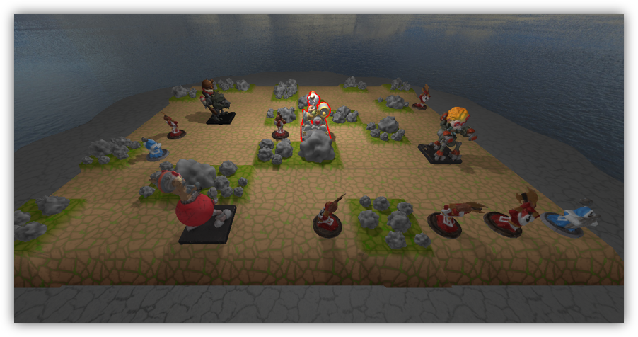

During my master's studies, Ian (a fellow student) and I developed a computer game as part of a practical lecture. It is based on the board game [Mechs vs. Minions](https://na.leagueoflegends.com/en/featured/mechs-vs-minions) by Riot Games.

This repository contains all my reports and all the presentations we had to give during the lecture. The [proposal](./Proposal.pdf) describes out initital plan, on how we wanted to implement the game. This included 4 milestones, for each of which we had to submit a report and give a presentation. The files on that can be found in the subdirectory or under the following links:

1. Milestone: [Report](./milestone1/Report%20Milestone%201.pdf), [Presentation](./milestone1/Presentation%20Milestone%201.pdf)
2. Milestone: [Report](./milestone2/Report%20Milestone%202.pdf), [Presentation](./milestone2/Presentation%20Milestone%202.pdf)
3. Milestone: [Report](./milestone3/Report%20Milestone%203.pdf), [Presentation](./milestone3/Presentation%20Milestone%203.pdf)
4. Milestone: [Report](./milestone4/Report%20Milestone%204.pdf), [Presentation](./milestone4/Presentation%20Milestone%204.pdf)

The code of our game is in [this Github repository](https://github.com/VeryCautious/Digital-Mechs-Vs-Minions-FanMade). As already described there: This digital version of Mechs vs Minions was created under Riot Games' ["Legal Jibber Jabber"](https://www.riotgames.com/en/legal) policy using assets owned by Riot Games. **Riot Games does not endorse or sponsor this project**.
